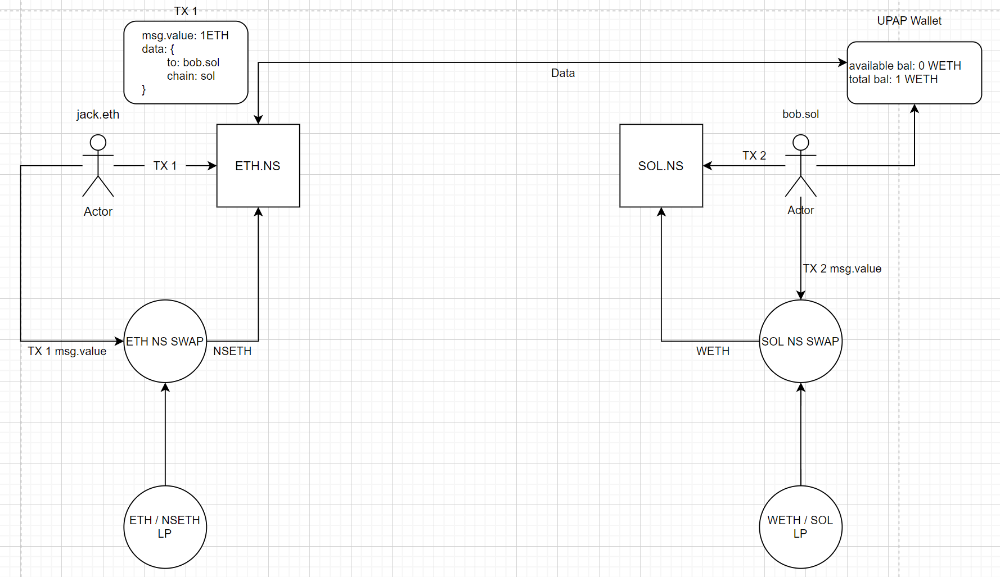

# Name Service Contract
## Overview
Name Service contract allows the ability to send and receive assets, both fungible and non-fungible, cross-chain without the need of the sender/receiver to use a bridge. Name Service works with UPAP Wallets on any network that support key pairs. 

Users sending assets using Name Service can pass the recipient's address, in the recipient's network format, as data. The recipient's UPAP Wallet can detect assets received through any Name Service contract on any network.

## Abstract of Ownership
Assets do not move from that network's Name Service contract until either an actor proves that they are the rightful owner or when a Roll-Up occurs. Proofs are done when Roll-Ups occur. Because Assets remain the contract until proof of ownership, gas fees will be paid by the recipient.

## Name Service Swaps
Every Name Service contract will have their own native swaps. Users on the network will have the ability to provide liquidity in pairs that benefit the use for other networks and tokens for high yields.

